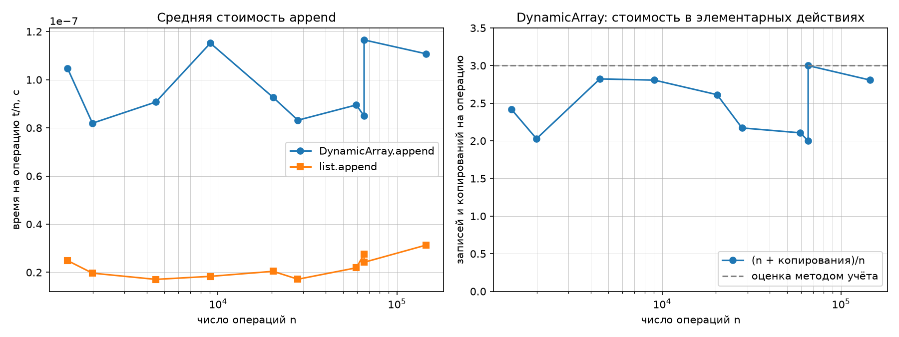
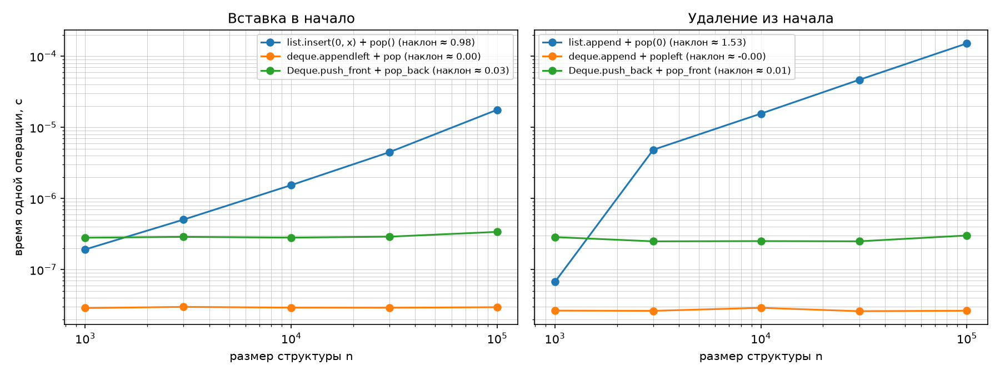

# Отчёт по лабораторной работе №2
**Тема:** Рекурсивные функции; динамический массив, стек и дек  
**Вариант:** 7 (`seed=37`)

---

## 1. Рекурсивные алгоритмы и мемоизация

### Оценка временной и пространственной сложности
1. **`factorial(n)`**:
   * **Временная сложность:** $O(n)$ — функция вызывает саму себя ровно $n$ раз (от $n$ до базового случая $1$), на каждом шаге за $O(1)$ выполняется одно умножение.
   * **Глубина стека вызовов:** $O(n)$.
2. **`fib_naive(n)`**:
   * **Временная сложность:** $O(\varphi^n)$, где $\varphi = \frac{1+\sqrt{5}}{2} \approx 1.618$ (экспоненциальный рост), так как каждый вызов порождает два новых подвызова `fib_naive(n-1)` и `fib_naive(n-2)` с многократным пересчётом одних и тех же значений.
   * **Число вызовов (точная формула):** $C_{\text{naive}}(n) = 2 \cdot F(n+1) - 1$. Например, при $n = 10$: $2 \cdot F(11) - 1 = 2 \cdot 89 - 1 = 177$; при $n = 30$: $2 \cdot F(31) - 1 = 2 \cdot 1\,346\,269 - 1 = 2\,692\,537$.
3. **`fib_memo(n)`**:
   * **Временная сложность:** $O(n)$ — каждое значение $F(k)$ для $k \in \{2, \dots, n\}$ вычисляется ровно один раз и сохраняется в словаре `memo`, а повторные обращения возвращают готовый ответ за $O(1)$.
   * **Число вызовов (точная формула):** $C_{\text{memo}}(n) = 2n - 1$ (при $n \ge 1$). При $n = 30$: $2 \cdot 30 - 1 = 59$ вызовов вместо $2\,692\,537$.
4. **`hanoi(n)`**:
   * **Временная сложность:** $O(2^n)$ — рекуррентное соотношение $T(n) = 2T(n-1) + 1$ даёт ровно $2^n - 1$ перемещений дисков.

### Таблица числа вызовов (`fib_naive` против `fib_memo`)

| $n$ | $F(n)$ | Вызовов `fib_naive` | Формула $2F(n+1)-1$ | Вызовов `fib_memo` | Формула $2n-1$ |
|---:|---:|---:|---:|---:|---:|
| 5 | 5 | 15 | 15 | 9 | 9 |
| 10 | 55 | 177 | 177 | 19 | 19 |
| 15 | 610 | 1 973 | 1 973 | 29 | 29 |
| 20 | 6 765 | 21 891 | 21 891 | 39 | 39 |
| 25 | 75 025 | 242 785 | 242 785 | 49 | 49 |
| 30 | 832 040 | 2 692 537 | 2 692 537 | 59 | 59 |

---

## 2. Динамический массив (`DynamicArray`) и амортизированный анализ

### Обоснование $O(1)$ методом учёта (Accounting Method)
Начальная ёмкость массива равна $C_0 = 4$. При заполнении буфера (`size == capacity`) выделяется новый буфер удвоенного размера ($2C$), куда копируются все текущие $C$ элементов.

Назначим учётную стоимость одной операции `append` равной **3 элементарным монетам**:
1. **1 монета** тратится немедленно на запись самого элемента в свободную ячейку буфера.
2. **1 монета** кладётся в «резерв» при этом самом элементе (оплатит его будущее копирование при расширении).
3. **1 монета** кладётся в «резерв» одного из «старых» элементов, которые уже лежали в первой половине буфера после предыдущего удвоения.

К моменту, когда массив размера $C$ полностью заполнится (добавлено $C/2$ новых элементов с момента прошлого расширения), каждый из $C$ элементов в буфере имеет по 1 запасённой монете. Этого ровно хватает на оплату переноса всех $C$ элементов в новый буфер размера $2C$. Поскольку начальные 4 элемента не требовали предварительного расширения, общее число копирований всегда строго меньше $2n$, поэтому удельная стоимость в элементарных операциях удовлетворяет неравенству:
$$\frac{n + \text{copies}}{n} \le \frac{n + 2n - 4}{n} = 3 - \frac{4}{n} < 3$$

### Почему при $n = 65536$ и $n = 65537$ стоимость отличается почти на 1
* При $n = 65536 = 2^{16}$ буфер ровно заполнен до предела своей текущей ёмкости $65536$. Суммарное число копирований составляет $4 + 8 + 16 + \dots + 32768 = 65532$. Удельная стоимость минимальна:
  $$\frac{65536 + 65532}{65536} = 1.9999 \approx 2.000$$
* При добавлении следующего элемента ($n = 65537 = 2^{16} + 1$) срабатывает метод `_grow()`, который удваивает ёмкость до $131072$ и одномоментно копирует все $65536$ элементов. Общее число копирований вырастает до $65532 + 65536 = 131068$, а отношение скачкообразно увеличивается почти на $1$:
  $$\frac{65537 + 131068}{65537} = 2.9999 \approx 3.000$$

### Результаты замеров серий `append` (вариант 7)

| $n$ | `DynamicArray` $t/n$, с | `list` $t/n$, с | Копирований | $(n + \text{copies})/n$ |
|---:|---:|---:|---:|---:|
| 1 442 | 1.05e-07 | 2.49e-08 | 2 044 | 2.417 |
| 1 988 | 8.19e-08 | 1.97e-08 | 2 044 | 2.028 |
| 4 492 | 9.07e-08 | 1.71e-08 | 8 188 | 2.823 |
| 9 065 | 1.15e-07 | 1.83e-08 | 16 380 | 2.807 |
| 20 309 | 9.27e-08 | 2.04e-08 | 32 764 | 2.613 |
| 27 964 | 8.32e-08 | 1.71e-08 | 32 764 | 2.172 |
| 59 229 | 8.95e-08 | 2.19e-08 | 65 532 | 2.106 |
| 65 536 | 8.49e-08 | 2.75e-08 | 65 532 | 2.000 |
| 65 537 | 1.17e-07 | 2.42e-08 | 131 068 | 3.000 |
| 144 955 | 1.11e-07 | 3.13e-08 | 262 140 | 2.808 |

---

## 3. Сравнение операций у начала (`list` против `deque` и `Deque`)

### Таблица результатов (`n = 1000, 3000, 10000, 30000, 100000`)

| Операция и структура | $n=10^3$ | $n=3\cdot 10^3$ | $n=10^4$ | $n=3\cdot 10^4$ | $n=10^5$ | Наклон (log-log) |
|---|---:|---:|---:|---:|---:|---:|
| **Вставка в начало:** `list.insert(0, x) + pop()` | 1.93e-07 | 5.05e-07 | 1.54e-06 | 4.49e-06 | 1.77e-05 | **0.98** |
| **Вставка в начало:** `deque.appendleft + pop` | 2.89e-08 | 3.00e-08 | 2.93e-08 | 2.92e-08 | 2.97e-08 | **0.00** |
| **Вставка в начало:** `Deque.push_front + pop_back` | 2.82e-07 | 2.89e-07 | 2.82e-07 | 2.91e-07 | 3.40e-07 | **0.03** |
| **Удаление из начала:** `list.append + pop(0)` | 6.73e-08 | 4.84e-06 | 1.56e-05 | 4.66e-05 | 1.51e-04 | **1.53** |
| **Удаление из начала:** `deque.append + popleft` | 2.66e-08 | 2.64e-08 | 2.91e-08 | 2.61e-08 | 2.65e-08 | **-0.00** |
| **Удаление из начала:** `Deque.push_back + pop_front` | 2.87e-07 | 2.50e-07 | 2.52e-07 | 2.50e-07 | 3.02e-07 | **0.01** |

### Объяснение наклонов на log-log графике
* У стандартного списка `list` элементы хранятся в непрерывном блоке памяти. При вызове `list.insert(0, x)` или `list.pop(0)` все $n$ элементов массива необходимо физически сдвинуть в памяти на одну позицию вправо или влево. Это требует $O(n)$ операций, поэтому наклон на log-log графике близок к **1** (`0.98` для вставки; `1.53` для удаления из-за выхода за пределы кэша процессора при сдвиге больших массивов).
* В `collections.deque` и собственном `Deque` на базе двусвязного списка (`_Node`) добавление и удаление элемента в начале или конце сводится к перепривязке 2–3 указателей (`prev`, `next`, `head`/`tail`). Время выполнения не зависит от числа элементов $n$ и составляет строго $O(1)$ в худшем случае, что даёт горизонтальную прямую с наклоном около **0** (`0.00`, `0.03`, `0.01`).

---

## 4. Сравнение на операциях варианта и проверка инвариантов

### Время на операцию на трассах варианта 7
* **`ops_stack.txt`**: `Stack` — `1.14e-07` с, `list` — `3.92e-08` с (своя реализация в **2.9 раза медленнее**).
* **`ops_deque.txt`**: `Deque` — `1.84e-07` с, `collections.deque` — `4.19e-08` с (своя реализация в **4.4 раза медленнее**).

**Причина постоянного множителя при одинаковой асимптотике $O(1)$:**
Стандартные структуры `list` и `collections.deque` реализованы в CPython на языке C (машинный код без накладных расходов интерпретатора на каждую внутреннюю строчку), а `collections.deque` дополнительно использует двусвязный список блоков по 64 элемента (лучшая локальность кэша и редкие аллокации памяти). Собственные классы `Stack`, `DynamicArray` и `Deque` выполняются в байткоде Python, делают дополнительные вызовы методов-обёрток и выделяют отдельный Python-объект `_Node` при каждой вставке в дек.

### Добавленные проверки инвариантов в `self_check`
1. **Инвариант ёмкости и копирований `DynamicArray`:** после 5 последовательных вызовов `append` проверено соотношение `0 <= len(arr) <= arr.capacity`, удвоение ёмкости с 4 до 8 и точное число перенесённых элементов `copies == 4`.
2. **Очистка неиспользуемой памяти:** после вызова `pop()` проверено, что ячейка `_buffer[len(arr)]` сбрасывается в `None` (предотвращение утечки ссылок).
3. **Граничные указатели двусвязного списка `Deque`:** после вставок в начало и конец проверено, что ` _head.prev is None` и `_tail.next is None`.