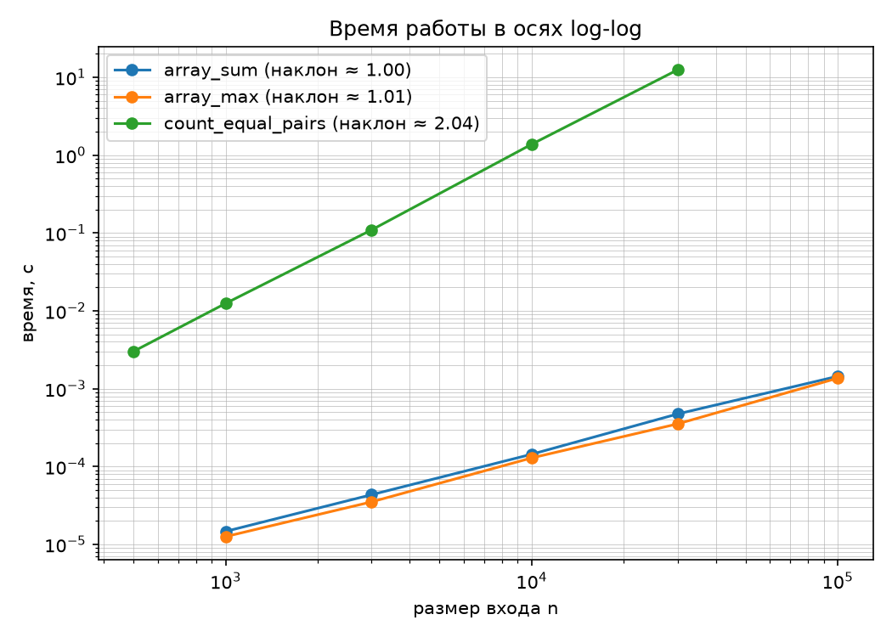
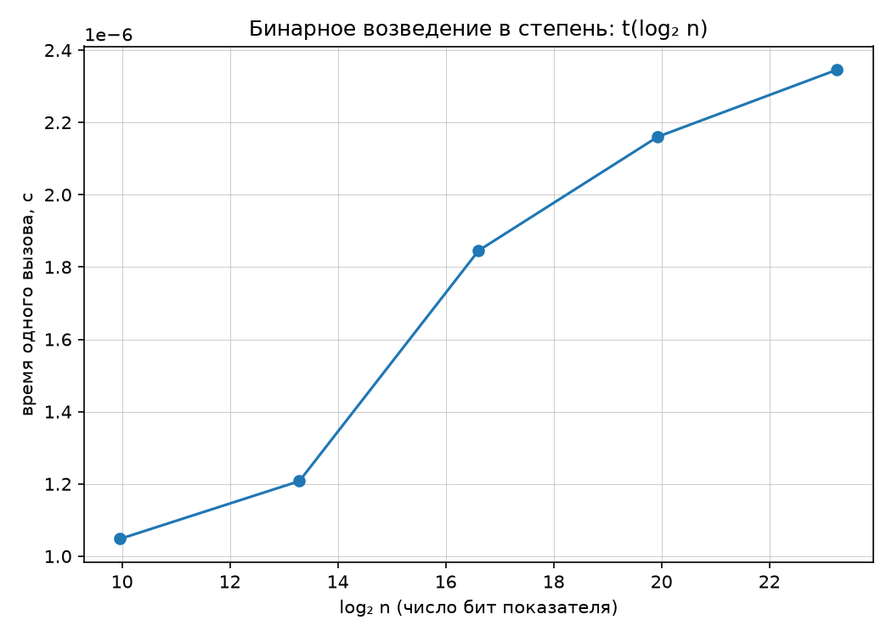

# Отчёт по лабораторной работе №1 «Анализ временной сложности элементарных алгоритмов»

**Выполнил:** Долин Дмитрий
**Вариант:** 7 (Seed = 37)

## 1. Аналитическая оценка алгоритмов

В рамках работы реализованы четыре элементарных алгоритма. Для каждого проведена аналитическая оценка асимптотической сложности в худшем случае (модель RAM):

*   **Сумма элементов (`array_sum`) и Поиск максимума (`array_max`):** 
    Алгоритмы осуществляют один последовательный проход по массиву длины $n$. На каждой итерации выполняется константное $O(1)$ количество операций (сложение или сравнение). Вложенных циклов нет. Следовательно, теоретическая сложность — **$O(n)$**.
*   **Подсчёт равных пар (`count_equal_pairs`):**
    В алгоритме используется двойной вложенный цикл для проверки всех уникальных пар элементов. Внешний цикл выполняется $n$ раз, внутренний — $n-1, n-2, \dots, 1$ раз. Сумма арифметической прогрессии итераций составляет $\frac{n(n-1)}{2}$. Отбрасывая константы и младшие члены, получаем сложность **$O(n^2)$**.
*   **Бинарное возведение в степень (`binary_pow`):**
    На каждой итерации цикла показатель степени $n$ делится на 2 нацело. Цикл завершается, когда $n$ достигает нуля. Количество шагов равно числу битов в показателе степени, то есть $\approx \log_2 n$. Каждая итерация содержит операции $O(1)$ (возведение в квадрат и умножение по модулю). Итоговая сложность — **$O(\log n)$**.

## 2. Верификация и инварианты

Реализованные алгоритмы успешно прошли проверку на корректность:
*   **Сверка с эталонами:** результаты совпали с поведением встроенных функций Python `sum()`, `max()` и `pow(x, y, mod)`.
*   **Граничные случаи:** корректно обрабатываются пустые массивы (сумма равна 0, число пар равно 0) и массив из одного элемента.
*   **Пользовательские инварианты:** добавлена проверка того, что количество равных пар в массиве, где все элементы уникальны (например, `[1, 2, 3, 4, 5]`), строго равно $0$, а также проверка возведения любого числа в нулевую степень.

## 3. Результаты профилирования

Замеры времени выполнения производились по методике бенчмаркинга (предварительный прогрев, 5 повторений, медианное значение) на детерминированных данных варианта. 

Эмпирически вычисленные наклоны прямых в осях log-log:
*   `array_sum`: **1.004**
*   `array_max`: **1.015**
*   `count_equal_pairs`: **2.037**

**Вывод по замерам:** 
Экспериментальные наклоны для линейных алгоритмов практически равны $1$, а для алгоритма подсчета пар — близки к $2$. Это полностью подтверждает теоретические оценки $O(n)$ и $O(n^2)$. Незначительные отклонения от идеальных целых чисел (0.004 — 0.037) обусловлены накладными расходами интерпретатора Python, работой кэш-памяти процессора и фоновыми процессами операционной системы во время выполнения.

## 4. Графики зависимости времени выполнения

## 5. Ответы на контрольные вопросы

1.  **Почему для логарифмического алгоритма неинформативен график в осях log-log?**
    Уравнение логарифмического роста имеет вид $t = c \cdot \log n$. В осях log-log обе части логарифмируются: $\log t = \log c + \log(\log n)$. Полученная зависимость $\log(\log n)$ не является линейной функцией вида $y = kx + b$, поэтому на таком графике невозможно визуально определить порядок роста (наклон). Для наглядности используется полулогарифмический масштаб (ось $X$ строится как $\log_2 n$).
2.  **Зачем замер возведения в степень выполняется по модулю?**
    В Python встроена поддержка длинной арифметики. Если возводить числа в огромные степени (например, $10^7$) без модуля, результат будет состоять из миллионов цифр. В этом случае базовая операция перемножения чисел в памяти перестанет выполняться за время $O(1)$ и станет основным «узким местом». Использование модуля ограничивает размер чисел, гарантируя константное время выполнения одной операции умножения.