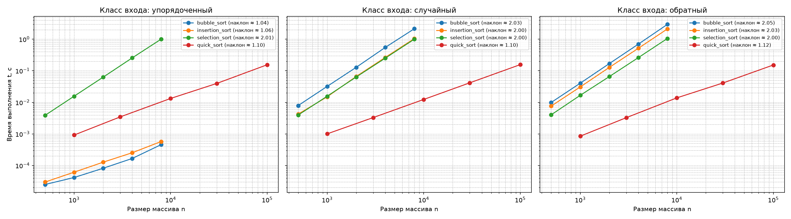

# Отчёт по лабораторной работе №3
**Тема:** Экспериментальное сравнение простых сортировок; QuickSort с рандомизацией опорного элемента  
**Вариант:** 7 (`seed = 37`)

---

## 1. Аналитическая оценка алгоритмов

### Временная сложность и сравнение характеристик

1. **Сортировка пузырьком (`bubble_sort`):**
   * **Худший случай (обратный порядок):** $O(n^2)$ сравнений и $O(n^2)$ обменов. Требуется полный проход по всем парам.
   * **Средний случай (случайный порядок):** $O(n^2)$ сравнений и $O(n^2)$ обменов (число обменов пропорционально числу инверсий в массиве, $\approx n(n-1)/4$).
   * **Лучший случай (упорядоченный массив):** $O(n)$ сравнений и $0$ обменов благодаря флагу досрочного выхода `swapped`: если за первый внешний проход не выполнено ни одного обмена, цикл прерывается.
2. **Сортировка вставками (`insertion_sort`):**
   * **Худший случай (обратный порядок):** $O(n^2)$ сравнений и сдвигов элементов.
   * **Средний случай (случайный порядок):** $O(n^2)$ сравнений и сдвигов ($\approx n^2/4$).
   * **Лучший случай (упорядоченный массив):** $O(n)$ сравнений и $0$ сдвигов. Каждый элемент проверяется с левым соседом ровно один раз и сразу остаётся на месте (`break`).
3. **Сортировка выбором (`selection_sort`):**
   * **Все случаи (лучший, средний, худший):** строго $\Theta(n^2)$ по числу сравнений. На каждом шаге $i$ алгоритм просматривает все элементы от $i+1$ до $n-1$, суммарное число сравнений фиксировано:
     $$\sum_{i=0}^{n-2} (n - 1 - i) = \frac{n(n - 1)}{2}$$
   * **Число обменов:** не более $n - 1$, то есть $O(n)$ во всех случаях.
4. **Быстрая сортировка (`quick_sort` с рандомизацией):**
   * **Средний случай:** $O(n \log n)$. Рандомизированный выбор опорного элемента делит массив на подмассивы пропорционального размера, глубина рекурсии составляет $O(\log n)$, а на каждом уровне выполняется разбиение за $O(n)$.
   * **Худший случай:** теоретически $O(n^2)$ при постоянном выборе минимального или максимального элемента, однако вероятность такого исхода при `random.randrange` пренебрежимо мала.

---

## 2. Верификация и стабильность

### Верификация реализаций
* Пройдены тесты на граничных случаях: пустой массив `[]`, один элемент `[7]`, массив одинаковых элементов `[5, 5, 5, 5]`, отсортированный и обратно отсортированный массивы (`self_check: OK`).
* Корректность подтверждена сверкой со стандартной функцией `sorted()` на 300 случайных входах разной длины и диапазона.

### Демонстрация стабильности на парах `(ключ, метка)`
Для проверки стабильности использовался массив:
`[(2, 'a'), (1, 'b'), (2, 'c'), (1, 'd'), (2, 'e')]`

Результаты работы алгоритмов:
* **`bubble_sort`:** `[(1, 'b'), (1, 'd'), (2, 'a'), (2, 'c'), (2, 'e')]` $\rightarrow$ **СТАБИЛЬНА**. Равные элементы не меняются местами благодаря строгому условию `res[j] > res[j + 1]`.
* **`insertion_sort`:** `[(1, 'b'), (1, 'd'), (2, 'a'), (2, 'c'), (2, 'e')]` $\rightarrow$ **СТАБИЛЬНА**. Элемент вставляется строго после уже имеющихся элементов с таким же ключом (`res[j] > cur`).
* **`selection_sort`:** `[(1, 'b'), (1, 'd'), (2, 'c'), (2, 'a'), (2, 'e')]` $\rightarrow$ **НЕСТАБИЛЬНА**. При обмене найденного минимума с текущим элементом нарушается относительный порядок одинаковых ключей (метка `'a'` перескочила за `'c'`).
* **`quick_sort`:** `[(1, 'd'), (1, 'b'), (2, 'c'), (2, 'e'), (2, 'a')]` $\rightarrow$ **НЕСТАБИЛЬНА**. Обмены через опорный элемент перемещают равные значения через весь подмассив, перемешивая их взаимный порядок.

---

## 3. Анализ числа операций на $n = 1000$

| Алгоритм | Класс входа | Сравнения | Обмены / сдвиги | Теоретическое совпадение |
|---|---|---:|---:|---|
| **`bubble_sort`** | упорядоченный | 999 | 0 | $n - 1 = 999$ (выход за 1 проход) |
| **`bubble_sort`** | случайный | 497 789 | 238 804 | $\approx n(n-1)/2$ сравнений, $\approx n^2/4$ обменов |
| **`bubble_sort`** | обратный | 499 500 | 499 499 | Ровно $n(n-1)/2 = 499\,500$ сравнений и обменов |
| **`insertion_sort`** | упорядоченный | 999 | 0 | $n - 1 = 999$ сравнений (лучший случай $O(n)$) |
| **`insertion_sort`** | случайный | 239 800 | 238 804 | Сдвигов ровно столько же, сколько инверсий |
| **`insertion_sort`** | обратный | 499 500 | 499 499 | Максимальное число инверсий $n(n-1)/2$ |
| **`selection_sort`** | упорядоченный | 499 500 | 0 | Ровно $\frac{1000 \cdot 999}{2} = 499\,500$ сравнений |
| **`selection_sort`** | случайный | 499 500 | 986 | Число сравнений неизменно; обменов $\le n - 1$ |
| **`selection_sort`** | обратный | 499 500 | 500 | Ровно $n/2 = 500$ парных обменов |

---

## 4. Результаты замеров времени выполнения

### Простые сортировки ($n \in [500, 8000]$)

| Алгоритм | Класс входа | $n=500$ | $n=1000$ | $n=2000$ | $n=4000$ | $n=8000$ |
|---|---|---:|---:|---:|---:|---:|
| **`bubble_sort`** | упорядоченный | 0.000025 c | 0.000042 c | 0.000082 c | 0.000167 c | 0.000461 c |
| | случайный | 0.007892 c | 0.032005 c | 0.128563 c | 0.548224 c | 2.137842 c |
| | обратный | 0.009910 c | 0.040378 c | 0.168428 c | 0.696212 c | 2.943870 c |
| **`insertion_sort`** | упорядоченный | 0.000030 c | 0.000061 c | 0.000128 c | 0.000254 c | 0.000577 c |
| | случайный | 0.004231 c | 0.014956 c | 0.066115 c | 0.264323 c | 1.045082 c |
| | обратный | 0.007625 c | 0.030706 c | 0.127719 c | 0.515264 c | 2.109184 c |
| **`selection_sort`** | упорядоченный | 0.003869 c | 0.015631 c | 0.062679 c | 0.255505 c | 1.006902 c |
| | случайный | 0.003950 c | 0.015640 c | 0.063480 c | 0.250720 c | 0.999487 c |
| | обратный | 0.004031 c | 0.016677 c | 0.065302 c | 0.260766 c | 1.052588 c |

### Быстрая сортировка `quick_sort` ($n \in [1000, 100000]$)

| Класс входа | $n=1000$ | $n=3000$ | $n=10000$ | $n=30000$ | $n=100000$ |
|---|---:|---:|---:|---:|---:|
| **упорядоченный** | 0.000922 c | 0.003456 c | 0.013290 c | 0.039617 c | 0.154874 c |
| **случайный** | 0.001006 c | 0.003298 c | 0.012347 c | 0.041495 c | 0.156335 c |
| **обратный** | 0.000849 c | 0.003272 c | 0.013846 c | 0.040889 c | 0.152255 c |

### Анализ наклонов на log-log графиках
* Для простых алгоритмов на случайном и обратном входах при увеличении $n$ в 2 раза время возрастает примерно в 4 раза, что соответствует наклону прямой $\approx 2.0$ (асимптотика $O(n^2)$).
* На упорядоченном входе `bubble_sort` и `insertion_sort` показывают линейный рост времени при удвоении $n$ (наклон $\approx 1.0$, лучший случай $O(n)$), в то время как `selection_sort` сохраняет квадратичный рост (наклон $\approx 2.0$) из-за неизменного выполнения всех $n(n-1)/2$ сравнений.
* Для `quick_sort` на всех трёх классах входов наклоны прямых близки к $1.0 - 1.1$, что соответствует оценке $O(n \log n)$. На размере $n = 100\,000$ алгоритм завершает работу за $\approx 0.15$ с, тогда как простым сортировкам для такого объёма потребовалось бы несколько минут.

---

## 5. Выводы и ответы на контрольные вопросы

1. **Почему сортировка выбором выполняет $\Theta(n^2)$ сравнений на любом входе и чем отличается от вставок:**  
   Сортировка выбором ищет минимум в оставшейся неотсортированной части массива полным перебором до конца, не имея условия досрочного выхода. В сортировке вставками поиск позиции для вставки прекращается при первом же сравнении, где найден меньший элемент, что сокращает число сравнений до $n - 1$ на упорядоченных данных.
2. **Что такое стабильность сортировки и почему пузырёк стабилен:**  
   Стабильность гарантирует сохранение взаимного порядка элементов с одинаковыми ключами. Пузырёк стабилен, так как условие обмена строгое (`res[j] > res[j + 1]`); равные элементы никогда не меняются местами. Стабильность критична при последовательной многоуровневой сортировке (например, сначала по имени, затем по подразделению).
3. **За счёт чего QuickSort достигает среднего времени $O(n \log n)$:**  
   За счёт сбалансированного разбиения массива на две части относительно опорного элемента. Высота дерева рекурсии составляет $O(\log n)$, а суммарные затраты на разбиение на каждом уровне равны $O(n)$.
4. **Худший случай QuickSort и роль рандомизации:**  
   Худший случай $O(n^2)$ возникает при постоянном выборе минимального или максимального элемента подмассива (сильный дисбаланс $0$ и $n-1$). При детерминированном выборе первого элемента он воспроизводится на отсортированном или обратно отсортированном входе. Рандомизация (`randrange`) исключает зависимость опорного элемента от входного порядка, сводя вероятность худшего случая к нулю.